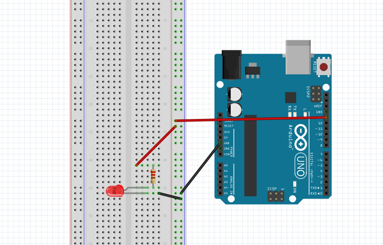

#Setup

##Hook up your Arduino

Take out your arduino board and USB cable and connect the arduino to your workstation as shown in the below diagram: 


##Open the Arduino IDE

Go to Start -> Programs and click on Arduino IDE. You should see something similar to the following: 


##Build Circuit

We wire up the experiment as shown in figure 2.


##Write the code

Create a new sketch in Arduino IDE:

Enter the following code and upload it to the board:

```
// the setup function runs once when you press reset or power the board
void setup() {
  // initialize digital pin 13 as an output.
  pinMode(13, OUTPUT);
}

// the loop function runs over and over again forever
void loop() {
  digitalWrite(13, HIGH);   // turn the LED on (HIGH is the voltage level)
  delay(1000);              // wait for a second
  digitalWrite(13, LOW);    // turn the LED off by making the voltage LOW
  delay(1000);              // wait for a second
}
```

##Challenge (If you have the time...)

Try the following challenges:

- Change the program to make the LED blink faster (e.g. every 0.5 seconds).
- Make two LEDs blink simulaniously (hint: get another LED and connect the anode in series with a 220-ohm resistor to pin 12. Connect cathodes connect to ground. Then update the program to blink the LED.
