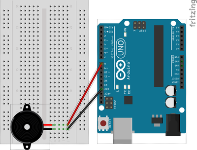

#Circuit

Wire up the experiment as shown in fig. 1



#The Code

In the Arduino IDE, create a new sketch and enter the following code:

```
/*
   Melody - Plays a melody
   This example code is in the public domain.
   */
#include "pitches.h"

int melody[] = { // notes in the melody:
  NOTE_C4, NOTE_G3, NOTE_G3, NOTE_A3, NOTE_G3, 0, NOTE_B3, NOTE_C4
};

// note durations: 4 = quarter note, 8 = eighth note, etc.:
int noteDurations[] = {
  4, 8, 8, 4, 4, 4, 4, 4
};

void setup() {
  // iterate over the notes of the melody:
  for (int thisNote = 0; thisNote < 8; thisNote++) {
    // to calculate the note duration, take one second
    // divided by the note type.
    //e.g. quarter note = 1000 / 4, eighth note = 1000/8, etc.
    int noteDuration = 1000 / noteDurations[thisNote];
    tone(8, melody[thisNote], noteDuration);
    // to distinguish the notes, set a minimum time between them.
    // the note's duration + 30% seems to work well:
    int pauseBetweenNotes = noteDuration * 1.30;
    delay(pauseBetweenNotes);
    noTone(8);
  }
}

void loop() {
    // no need to repeat the melody.
}
```
You can download the code from [here](./Sketches/exp3_generating_music.zip) if you wish. As soon as the Arduino boots it should play a series of musical notes and then stop. For more information see the online reference page for the functions used in this experiment here: https://www.arduino.cc/en/Reference/Tone