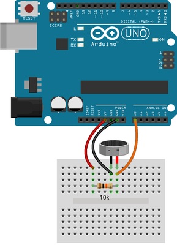

#Circuit

Wire up the experiment as shown in fig. 1



The microphone module is polarised, which means it has a positive and negative terminal which must be correctly placed in the circuit in order to function as expected. Please examine fig: 2 to correctly identify which leg is positive and which is negative.


##The Code

In the Arduino IDE, create a new sketch and enter the following code:

```
//global variables
int readValue;
int maximumValue;
int minimumValue; 


// will reset maximum and minimum values only when we call it
void resetMaximumAndMinimum() 
{
  maximumValue = 0;             // set maximum to lowest value possible
  minimumValue = 32767;         // set minimum to highest value possible
}


// this runs only once on the startup
void setup() 
{
  // initialize built-in LED light at digital pin 13 as an output
  pinMode(13, OUTPUT);           
  resetMaximumAndMinimum();
}


// the loop runs over and over again forever
void loop() 
{
  // read current value from the microphone
  readValue = analogRead(A0);     

  // if read value is smaller than minimum then set it as the new minimum
  if (readValue < minimumValue)   
  {
    minimumValue = readValue;     
  }

  // if read value is bigger than maximum then set it as the new maximum
  if (readValue > maximumValue)   
  {
    maximumValue = readValue;     
  }

  // Change the 10 constant to adjust the sensitivity.
  //   To 20 if you want the light triggered on louder claps   
  //   Ti 5  if you want the light triggered on quieter noises 
  //   Feel free to experiment with the values.
  if ( (maximumValue - minimumValue) > 10 ) 
  {
    digitalWrite(13, HIGH);       // turn the LED on (HIGH is the voltage level)
    delay(2 * 1000);              // wait for 2 seconds (2 * 1000ms)
    digitalWrite(13, LOW );       // turn the LED off by making the voltage LOW

    // if we wouldn't clear the max & min then after first trigger it would get 
    // triggered every single time no matter what read values were
    resetMaximumAndMinimum();     
  }
}
```

##The Code 2

There's usually more than one way to write a program.This sketch does the same thing as the provious one...

```
//global constants
#define noiseThreshold  10           // increasing it will make trigger less sensitive
#define microphonePin   A0           // analog  pin A0 is connected to microphone
#define ledPin          13           // digital pin 13 is connected to LED
#define ledTime          3           // LED will be lit for 3 seconds


// this runs only once on the startup
void setup() {
  // initialize desired ledPin as output
  pinMode(ledPin, OUTPUT);           
}


// the loop runs over and over again forever
void loop() {
  static unsigned int maximumValue =     0;
  static unsigned int minimumValue = 65535; 

  // read current value from the microphone
  unsigned int readValue = analogRead(microphonePin);  

  // if read value is bigger/smaller than our current max/min then update our max/min
  if (readValue < minimumValue) { 
    minimumValue = readValue;     
  }
  if (readValue > maximumValue) { 
    maximumValue = readValue;     
  }

  // if the noise was too loud lit the light
  if ( (maximumValue - minimumValue) > noiseThreshold ) {
    digitalWrite(ledPin, HIGH);      // turn the LED on (HIGH is the voltage level)
    delay(ledTime * 1000);           // wait for predefined time
    digitalWrite(ledPin, LOW );      // turn the LED off by making the voltage LOW

    maximumValue =     0;            // set maximum to lowest value possible
    minimumValue = 65535;            // set minimum to highest value possible
  }
}
```

